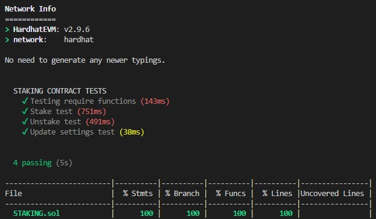

  

Контракт пары [0xDf24B4cF75Da6362d2BbB89e8Fb9711727e9462e](https://rinkeby.etherscan.io/address/0xDf24B4cF75Da6362d2BbB89e8Fb9711727e9462e)   
Для создания пула ликвидности использовались токены  
* BNT [0x80715c8c36b6f007F5c53F42565bcF59BcEC3F2A](https://rinkeby.etherscan.io/token/0x80715c8c36b6f007f5c53f42565bcf59bcec3f2a) 
* CNT [0xe77EfB5E177e22343A0ef8777dD838202CD01BDF](https://rinkeby.etherscan.io/token/0xe77efb5e177e22343a0ef8777dd838202cd01bdf)  

Был создан контракт стейкинга [0xF425F375C07592e85b41FCe7e3c7111e368Ba86c](https://rinkeby.etherscan.io/address/0xF425F375C07592e85b41FCe7e3c7111e368Ba86c)  
и на нем были застейканы лп токены. 

Был создан контракт для ревард токенов [0x0FD69970C3A931F5b40f1EC602AE98Ec0672e477](https://rinkeby.etherscan.io/token/0x0fd69970c3a931f5b40f1ec602ae98ec0672e477)  
и ревард токены были отправлены на контракт стейкинга.  